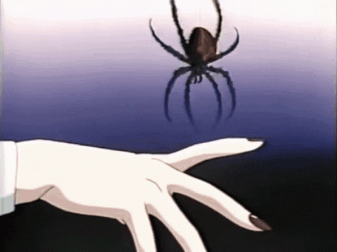

<h1 align="center">
  
  𝕭𝖔𝖓𝖏𝖔𝖚𝖗, 𝖒𝖔𝖗𝖙𝖆𝖑.
  
</h1>

<table>
<tr>
<td width="65%" valign="top">

# Rigel Shaw — Tanjil Ahmed  
*quiet. deliberate. building things that linger.*

i'm a B.Tech (CS) student at VIT Chennai.  
i study systems, stories and polish — currently learning **Unity (C#)** and **UI/UX (Figma)**.  
i take part in hackathons and I learn fastest by shipping small, playable prototypes.

</td>
<td width="35%" align="center">

</td>
</tr>
</table>

---

## ⚔️ Current Focus
- Mastering Unity fundamentals (movement, collisions, UI).  
- Practicing UI/UX flows and micro-interactions.  
- Improving GitHub hygiene and building small, complete projects.  

---

## 📂 Selected Work
- **Prevexa** — Codezilla hackathon (team of 5). *Role:* integration & UI testing → demo & repo pinned.  
- **Bear Catcher** — Plezmo (AIM / NITI Aayog, 2020).  
- **Prototype plans:** currently building foundations in Unity.  

*(links: Plezmo profile • Prevexa repo • certificates — coming_soon)*  

---

## 🕯️ What I Bring
- curious, disciplined, and team-focused.  
- ship small things well; iterate fast.  
- care about polish: UI feel, loading smoothness, subtle audio cues.  
- open to hackathons, collabs and mentorship — i show up, and i follow through.  

---

## ⚙️ Tech & Tools  
 
 
 
  

---

## 📊 Stats That Matter  

  
  

  

---

## 🕸️ Roadmap 2025
- 🕯 Publish **3 Unity prototypes** (small, polished, playable).  
- 🕯 Build an **open-source UI kit** for devs/designers.  
- 🕯 Crack a **hackathon win** with a story-driven game.  
- 🕯 Strengthen **C++ & system-level coding** for placements.  
- 🕯 Create a **dev log series** (sharing code + aesthetics).  

---

## 🐍 Animations  

  

  

---

**Contact:** [tana798930@gmail.com](mailto:tana798930@gmail.com) — i reply fast.  

> *“The world is quiet here. The code speaks louder than words.”*  

<!--
**rigelshaw/rigelshaw** is a ✨ _special_ ✨ repository because its `README.md` (this file) appears on your GitHub profile.

Here are some ideas to get you started:

- 🔭 I’m currently working on ...
- 🌱 I’m currently learning ...
- 👯 I’m looking to collaborate on ...
- 🤔 I’m looking for help with ...
- 💬 Ask me about ...
- 📫 How to reach me: ...
- 😄 Pronouns: ...
- ⚡ Fun fact: ...
-->
